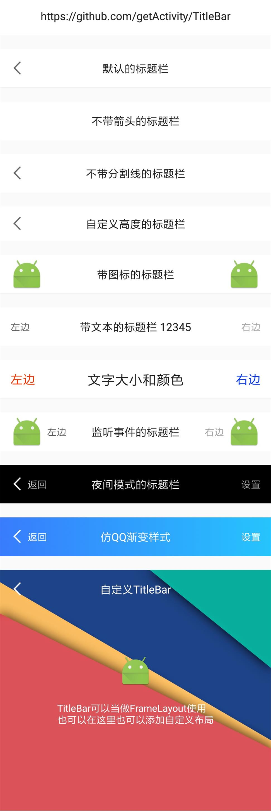

# 标题栏

> 博客地址：[Android标题栏（TitleBar）绝佳解决方案](https://www.jianshu.com/p/617be02dc265)

> 已投入公司项目多时，没有任何毛病，可胜任任何需求，[点击此处下载Demo](https://raw.githubusercontent.com/getActivity/TitleBar/master/TitleBar.apk)

> 想了解实现原理的可以参考文章：[纯手工打造一个通用的标题栏TitleBar](https://www.jianshu.com/p/ccf6506335e7)




#### 集成步骤

    dependencies {
        implementation 'com.hjq:titlebar:2.0'
    }

#### 属性大全（划重点，要考）

    <declare-styleable name="TitleBar"  tools:ignore="ResourceName">
        <!-- 标题 -->
        <attr name="title" format="string" />
        <attr name="title_left" format="string"/>
        <attr name="title_right" format="string" />
        <!-- 图标 -->
        <attr name="icon_left" format="reference" />
        <attr name="icon_right" format="reference" />
        <!-- 返回按钮，默认开 -->
        <attr name="icon_back" format="boolean" />
        <!-- 文字颜色 -->
        <attr name="color_title" format="color" />
        <attr name="color_right" format="color" />
        <attr name="color_left" format="color" />
        <!-- 文字大小 -->
        <attr name="size_title" format="dimension" />
        <attr name="size_right" format="dimension" />
        <attr name="size_left" format="dimension" />
        <!-- 按钮背景 -->
        <attr name="background_left" format="reference|color" />
        <attr name="background_right" format="reference|color" />
        <!-- 分割线 -->
        <attr name="line" format="boolean" />
        <attr name="color_line" format="color" />
    </declare-styleable>

#### XML示例

    <com.hjq.bar.TitleBar
        android:layout_width="match_parent"
        android:layout_height="wrap_content"
        android:layout_marginTop="60dp"
        app:title="默认的标题栏" />

    <com.hjq.bar.TitleBar
        android:layout_width="match_parent"
        android:layout_height="wrap_content"
        android:layout_marginTop="20dp"
        app:icon_back="false"
        app:title="不带箭头的标题栏" />

    <com.hjq.bar.TitleBar
        android:layout_width="match_parent"
        android:layout_height="wrap_content"
        android:layout_marginTop="20dp"
        app:line="false"
        app:title="不带分割线的标题栏" />

    <com.hjq.bar.TitleBar
        android:layout_width="match_parent"
        android:layout_height="50dp"
        android:layout_marginTop="20dp"
        app:title="自定义高度的标题栏" />

    <com.hjq.bar.TitleBar
        android:layout_width="match_parent"
        android:layout_height="wrap_content"
        android:layout_marginTop="20dp"
        app:icon_left="@mipmap/ic_launcher"
        app:icon_right="@mipmap/ic_launcher"
        app:title="带图标的标题栏" />

    <com.hjq.bar.TitleBar
        android:layout_width="match_parent"
        android:layout_height="wrap_content"
        android:layout_marginTop="20dp"
        app:icon_back="false"
        app:title="带文本的标题栏\n12345"
        app:title_left="左边"
        app:title_right="右边" />

    <com.hjq.bar.TitleBar
        android:layout_width="match_parent"
        android:layout_height="wrap_content"
        android:layout_marginTop="20dp"
        app:color_left="#FF3300"
        app:color_right="#0033FF"
        app:icon_back="false"
        app:size_left="18sp"
        app:size_right="18sp"
        app:size_title="20sp"
        app:title="文字大小和颜色"
        app:title_left="左边"
        app:title_right="右边" />

    <com.hjq.bar.TitleBar
        android:id="@+id/tb_main_title_bar"
        android:layout_width="match_parent"
        android:layout_height="wrap_content"
        android:layout_marginTop="20dp"
        app:icon_left="@mipmap/ic_launcher"
        app:icon_right="@mipmap/ic_launcher"
        app:title="监听事件的标题栏"
        app:title_left="左边"
        app:title_right="右边" />

    <com.hjq.bar.TitleBar
        style="@style/TitleBarNightStyle"
        android:layout_width="match_parent"
        android:layout_height="wrap_content"
        android:layout_marginTop="20dp"
        app:title_left="返回"
        app:title_right="设置"
        app:title="夜间模式的标题栏" />

    <com.hjq.bar.TitleBar
        android:layout_width="match_parent"
        android:layout_height="wrap_content"
        android:layout_marginTop="20dp"
        app:icon_back="false">

        <LinearLayout
            android:gravity="center_vertical"
            android:orientation="horizontal"
            android:layout_width="match_parent"
            android:layout_height="match_parent">

            <android.support.v7.widget.AppCompatCheckBox
                android:checked="true"
                android:layout_width="wrap_content"
                android:layout_height="wrap_content" />

            <TextView
                android:layout_weight="1"
                android:layout_width="0dp"
                android:layout_height="match_parent"
                android:gravity="center"
                android:text="TitleBar可以当做FrameLayout使用\n也可以在这里也可以添加自定义布局" />

            <android.support.v7.widget.SwitchCompat
                android:checked="true"
                android:layout_width="wrap_content"
                android:layout_height="wrap_content" />

        </LinearLayout>

    </com.hjq.bar.TitleBar>

#### 设置监听事件

    mTitleBar.setOnTitleBarListener(new OnTitleBarListener() {

        @Override
        public void onLeftClick(View v) {
            Toast.makeText(MainActivity.this, "左项被点击", Toast.LENGTH_SHORT).show();
        }

        @Override
        public void onTitleClick(View v) {
            Toast.makeText(MainActivity.this, "标题被点击", Toast.LENGTH_SHORT).show();
        }

        @Override
        public void onRightClick(View v) {
            Toast.makeText(MainActivity.this, "右项被点击", Toast.LENGTH_SHORT).show();
        }
    });

#### 统一TitleBar样式

> 如果对TitleBar的默认样式不满意，可以在Application初始化样式，具体可参考[DefaultStyle](https://github.com/getActivity/TitleBar/blob/master/library/src/main/java/com/hjq/bar/DefaultStyle.java)这个类的实现

	public class XXApplication extends Application {
	
	    @Override
	    public void onCreate() {
	        super.onCreate();
	        TitleBar.initStyle(new ITitleBarStyle());
		}
	}

#### 框架亮点

* 性能最佳：不使用LayoutInflater，而使用代码创建View的形式

* 体验最优：TitleBar默认样式效果已经非常好，可下载Demo测试

* 支持夜间模式：可以直接引用框架中的TitleBarNightStyle样式

* 支持自定义布局：可将TitleBar当做FrameLayout使用，直接在XML中自定义布局

* 支持全局配置样式：可以在Application中初始化TitleBar样式，达到一劳永逸的效果

#### Android技术讨论Q群：78797078

## License

```text
Copyright 2018 Huang Jinqun

Licensed under the Apache License, Version 2.0 (the "License");
you may not use this file except in compliance with the License.
You may obtain a copy of the License at

   http://www.apache.org/licenses/LICENSE-2.0

Unless required by applicable law or agreed to in writing, software
distributed under the License is distributed on an "AS IS" BASIS,
WITHOUT WARRANTIES OR CONDITIONS OF ANY KIND, either express or implied.
See the License for the specific language governing permissions and
limitations under the License.
```
