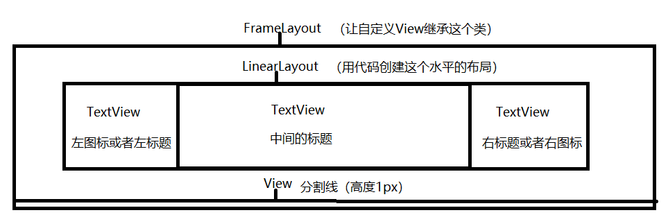
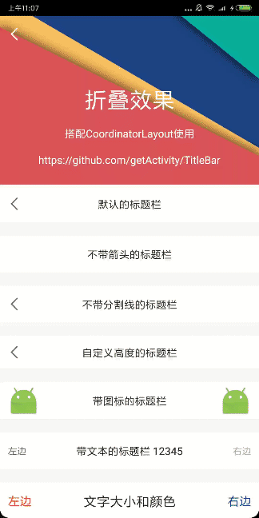

# 标题栏

> 博客地址：[Android标题栏（TitleBar）绝佳解决方案](https://www.jianshu.com/p/617be02dc265)

> 已投入公司项目多时，没有任何毛病，可胜任任何需求，[点击此处下载Demo](https://raw.githubusercontent.com/getActivity/TitleBar/master/TitleBar.apk)

> 想了解实现原理的可以参考文章：[纯手工打造一个通用的标题栏TitleBar](https://www.jianshu.com/p/ccf6506335e7)





## 5.0 版本、5.0 版本、5.0 版本 XML 属性已经改头换面了，请尽快进行[适配](Adaptive.md)

#### 集成步骤

    dependencies {
        implementation 'com.hjq:titlebar:6.0'
    }

#### 属性大全，[如何适配旧版本的属性？](Adaptive.md)

    <declare-styleable name="TitleBar" >
        <!-- 整体样式 -->
        <attr name="barStyle">
            <enum name="light" value="0x10" />
            <enum name="night" value="0x20" />
            <enum name="transparent" value="0x30" />
        </attr>
        <!-- 中间 -->
        <attr name="title" format="string" />
        <attr name="titleColor" format="color" />
        <attr name="titleSize" format="dimension" />
        <!-- 左边 -->
        <attr name="leftTitle" format="string"/>
        <attr name="leftIcon" format="reference" /><!-- leftIcon 优先于 backButton -->
        <attr name="backButton" format="boolean" /><!-- 返回按钮（默认开） -->
        <attr name="leftColor" format="color" />
        <attr name="leftSize" format="dimension" />
        <attr name="leftBackground" format="reference|color" />
        <!-- 右边 -->
        <attr name="rightTitle" format="string" />
        <attr name="rightIcon" format="reference" />
        <attr name="rightColor" format="color" />
        <attr name="rightSize" format="dimension" />
        <attr name="rightBackground" format="reference|color" />
        <!-- 分割线 -->
        <attr name="lineVisible" format="boolean" />
        <attr name="lineColor" format="reference|color" />
        <attr name="lineSize" format="dimension" />
    </declare-styleable>

#### XML示例

> [点我查看完整的Demo示例](https://github.com/getActivity/TitleBar/blob/master/app/src/main/res/layout/activity_main.xml)

    <com.hjq.bar.TitleBar
        android:layout_width="match_parent"
        android:layout_height="wrap_content"
        app:title="默认的标题栏" />

#### 设置监听事件

    mTitleBar.setOnTitleBarListener(new OnTitleBarListener() {

        @Override
        public void onLeftClick(View v) {
            ToastUtils.show("左项View被点击");
        }

        @Override
        public void onTitleClick(View v) {
            ToastUtils.show("中间View被点击");
        }

        @Override
        public void onRightClick(View v) {
            ToastUtils.show("右项View被点击");
        }
    });

#### 统一TitleBar样式

> 如果对TitleBar的默认样式不满意，可以在Application初始化样式，具体可参考[TitleBarLightStyle](https://github.com/getActivity/TitleBar/blob/master/library/src/main/java/com/hjq/bar/style/TitleBarLightStyle.java)的实现

	public class XXApplication extends Application {
	
	    @Override
	    public void onCreate() {
	        super.onCreate();
	        TitleBar.initStyle(new ITitleBarStyle());
	    }
	}

#### 混淆规则

    -keep class com.hjq.bar.** {*;}

#### 框架亮点

* 性能最佳：不使用LayoutInflater，而使用代码创建View的形式

* 体验最优：TitleBar默认样式效果已经非常好，可下载Demo测试

* 支持操控子控件：可以在代码中获取TitleBar的子控件进行调用相关的API

* 支持自定义布局：可将TitleBar当做FrameLayout使用，直接在XML中自定义布局

* 兼容沉浸式状态栏：兼容Github的沉浸式状态栏框架，达到完全沉浸的效果

* 框架兼容性良好：本框架不依赖任何第三方库，支持兼容所有的安卓版本

* 支持全局配置样式：可以在Application中初始化TitleBar样式，达到一劳永逸的效果

#### 作者的其他开源项目

* 架构工程：[AndroidProject](https://github.com/getActivity/AndroidProject)

* 权限框架：[XXPermissions](https://github.com/getActivity/XXPermissions)

* 吐司框架：[ToastUtils](https://github.com/getActivity/ToastUtils)

* 悬浮窗框架：[XToast](https://github.com/getActivity/XToast)

#### Android技术讨论Q群：78797078

#### 如果您觉得我的开源库帮你节省了大量的开发时间，请扫描下方的二维码随意打赏，要是能打赏个 10.24 :monkey_face:就太:thumbsup:了。您的支持将鼓励我继续创作:octocat:

 

## License

```text
Copyright 2018 Huang JinQun

Licensed under the Apache License, Version 2.0 (the "License");
you may not use this file except in compliance with the License.
You may obtain a copy of the License at

   http://www.apache.org/licenses/LICENSE-2.0

Unless required by applicable law or agreed to in writing, software
distributed under the License is distributed on an "AS IS" BASIS,
WITHOUT WARRANTIES OR CONDITIONS OF ANY KIND, either express or implied.
See the License for the specific language governing permissions and
limitations under the License.
```
