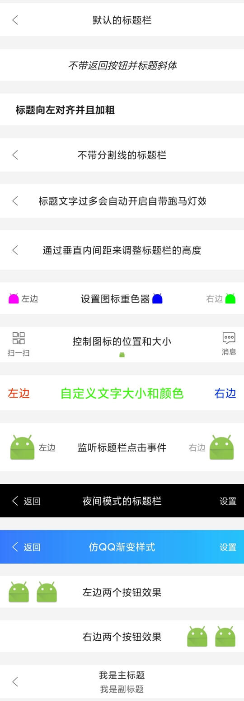

# 标题栏框架

* 项目地址：[Github](https://github.com/getActivity/TitleBar)、[码云](https://gitee.com/getActivity/TitleBar)

* 博客地址：[Android标题栏（TitleBar）绝佳解决方案](https://www.jianshu.com/p/617be02dc265)

* 可以扫码下载 Demo 进行演示或者测试，如果扫码下载不了的，[点击此处可直接下载](https://github.com/getActivity/TitleBar/releases/download/9.3/TitleBar.apk)


* 想了解实现原理的可以参考文章：[纯手工打造一个通用的标题栏 TitleBar](https://www.jianshu.com/p/ccf6506335e7)


### 9.0 版本 XML 属性已经改头换面了，请尽快进行[适配](Adaptive.md)

#### 集成步骤

* 如果你的项目 Gradle 配置是在 `7.0 以下`，需要在 `build.gradle` 文件中加入

```groovy
allprojects {
    repositories {
        // JitPack 远程仓库：https://jitpack.io
        maven { url 'https://jitpack.io' }
    }
}
```

* 如果你的 Gradle 配置是 `7.0 及以上`，则需要在 `settings.gradle` 文件中加入

```groovy
dependencyResolutionManagement {
    repositories {
        // JitPack 远程仓库：https://jitpack.io
        maven { url 'https://jitpack.io' }
    }
}
```

* 配置完远程仓库后，在项目 app 模块下的 `build.gradle` 文件中加入远程依赖

```groovy
android {
    // 支持 JDK 1.8
    compileOptions {
        targetCompatibility JavaVersion.VERSION_1_8
        sourceCompatibility JavaVersion.VERSION_1_8
    }
}

dependencies {
    // 标题栏框架：https://github.com/getActivity/TitleBar
    implementation 'com.github.getActivity:TitleBar:9.3'
}
```

#### 布局属性大全

```xml
<declare-styleable name="TitleBar">

    <!-- 标题栏背景 -->
    <attr name="android:background" />

    <!-- 标题栏样式 -->
    <attr name="barStyle">
        <enum name="light" value="0x10" />
        <enum name="night" value="0x20" />
        <enum name="transparent" value="0x30" />
        <enum name="ripple" value="0x40" />
    </attr>

    <!-- 子控件水平内间距 -->
    <attr name="childPaddingHorizontal" format="dimension" />
    <!-- 子控件垂直内间距（可用于调整标题栏自适应的高度） -->
    <attr name="childPaddingVertical" format="dimension" />

    <!-- 标题 -->
    <attr name="title" format="string" />
    <attr name="titleColor" format="reference|color" />
    <attr name="titleSize" format="dimension" />
    <attr name="titleGravity">
        <flag name="left" value="0x03" />
        <flag name="right" value="0x05" />
        <flag name="center" value="0x11" />
        <flag name="start" value="0x00800003" />
        <flag name="end" value="0x00800005" />
    </attr>
    <attr name="titleStyle">
        <flag name="normal" value="0" />
        <flag name="bold" value="1" />
        <flag name="italic" value="2" />
    </attr>
    <attr name="titleIcon" format="reference" />
    <attr name="titleIconWidth" format="dimension" />
    <attr name="titleIconHeight" format="dimension" />
    <attr name="titleIconPadding" format="dimension" />
    <attr name="titleIconTint" format="color" />
    <attr name="titleIconGravity">
        <flag name="top" value="0x30" />
        <flag name="bottom" value="0x50" />
        <flag name="left" value="0x03" />
        <flag name="right" value="0x05" />
        <flag name="start" value="0x00800003" />
        <flag name="end" value="0x00800005" />
    </attr>

    <!-- 左标题 -->
    <attr name="leftTitle" format="string"/>
    <attr name="leftTitleColor" format="reference|color" />
    <attr name="leftTitleSize" format="dimension" />
    <attr name="leftTitleStyle">
        <flag name="normal" value="0" />
        <flag name="bold" value="1" />
        <flag name="italic" value="2" />
    </attr>
    <attr name="leftIcon" format="reference" />
    <attr name="leftIconWidth" format="dimension" />
    <attr name="leftIconHeight" format="dimension" />
    <attr name="leftIconPadding" format="dimension" />
    <attr name="leftIconTint" format="color" />
    <attr name="leftIconGravity">
        <flag name="top" value="0x30" />
        <flag name="bottom" value="0x50" />
        <flag name="left" value="0x03" />
        <flag name="right" value="0x05" />
        <flag name="start" value="0x00800003" />
        <flag name="end" value="0x00800005" />
    </attr>
    <attr name="leftBackground" format="reference|color" />

    <!-- 右标题 -->
    <attr name="rightTitle" format="string" />
    <attr name="rightTitleColor" format="reference|color" />
    <attr name="rightTitleSize" format="dimension" />
    <attr name="rightTitleStyle">
        <flag name="normal" value="0" />
        <flag name="bold" value="1" />
        <flag name="italic" value="2" />
    </attr>
    <attr name="rightIcon" format="reference" />
    <attr name="rightIconWidth" format="dimension" />
    <attr name="rightIconHeight" format="dimension" />
    <attr name="rightIconPadding" format="dimension" />
    <attr name="rightIconTint" format="color" />
    <attr name="rightIconGravity">
        <flag name="top" value="0x30" />
        <flag name="bottom" value="0x50" />
        <flag name="left" value="0x03" />
        <flag name="right" value="0x05" />
        <flag name="start" value="0x00800003" />
        <flag name="end" value="0x00800005" />
    </attr>
    <attr name="rightBackground" format="reference|color" />

    <!-- 分割线 -->
    <attr name="lineVisible" format="boolean" />
    <attr name="lineDrawable" format="reference|color" />
    <attr name="lineSize" format="dimension" />

</declare-styleable>
```

#### XML示例

* [点我查看完整的 Demo 示例](app/src/main/res/layout/activity_main.xml)



#### 设置监听事件

```java
titleBar.setOnTitleBarListener(new OnTitleBarListener() {

    @Override
    public void onLeftClick(TitleBar titleBar) {
        ToastUtils.show("左项 View 被点击");
    }

    @Override
    public void onTitleClick(TitleBar titleBar) {
        ToastUtils.show("中间 View 被点击");
    }

    @Override
    public void onRightClick(TitleBar titleBar) {
        ToastUtils.show("右项 View 被点击");
    }
});
```

#### 统一 TitleBar 样式

* 如果对 TitleBar 的默认样式或者属性不满意，可以在 Application 初始化的地方进行拦截并修改

```java
public class XxxApplication extends Application {

    @Override
    public void onCreate() {
        super.onCreate();

        // 初始化 TitleBar 默认样式
        TitleBar.setDefaultStyle(new ITitleBarStyle());
    }
}
```

#### 框架亮点

* 性能最佳：不使用 LayoutInflater，而使用代码创建 View 的形式

* 体验最优：TitleBar 默认样式效果已经非常好，可下载 Demo 测试

* 支持操控子控件：可以在代码中获取 TitleBar 的子控件进行调用相关的 API

* 兼容沉浸式状态栏：兼容 Github 的沉浸式状态栏框架，达到完全沉浸的效果

* 框架兼容性良好：本框架不依赖任何第三方库，支持兼容所有的安卓版本

* 支持全局配置样式：可以在 Application 中初始化 TitleBar 样式，达到一劳永逸的效果

#### 作者的其他开源项目

* 安卓技术中台：[AndroidProject](https://github.com/getActivity/AndroidProject)  

* 安卓技术中台 Kt 版：[AndroidProject-Kotlin](https://github.com/getActivity/AndroidProject-Kotlin)  

* 权限框架：[XXPermissions](https://github.com/getActivity/XXPermissions)  

* 吐司框架：[ToastUtils](https://github.com/getActivity/ToastUtils)  

* 网络框架：[EasyHttp](https://github.com/getActivity/EasyHttp)  

* 悬浮窗框架：[XToast](https://github.com/getActivity/XToast)  

* Shape 框架：[ShapeView](https://github.com/getActivity/ShapeView)  

* 语种切换框架：[MultiLanguages](https://github.com/getActivity/MultiLanguages)  

* Gson 解析容错：[GsonFactory](https://github.com/getActivity/GsonFactory)  

* 日志查看框架：[Logcat](https://github.com/getActivity/Logcat)  

* Android 版本适配：[AndroidVersionAdapter](https://github.com/getActivity/AndroidVersionAdapter)  

* Android 代码规范：[AndroidCodeStandard](https://github.com/getActivity/AndroidCodeStandard)  

* Studio 精品插件：[StudioPlugins](https://github.com/getActivity/StudioPlugins)  

* 表情包大集合：[EmojiPackage](https://github.com/getActivity/EmojiPackage)  

* 省市区 Json 数据：[ProvinceJson](https://github.com/getActivity/ProvinceJson)  

#### 微信公众号：Android轮子哥


#### Android 技术分享 QQ 群：78797078

#### 如果您觉得我的开源库帮你节省了大量的开发时间，请扫描下方的二维码随意打赏，要是能打赏个 10.24 :monkey_face:就太:thumbsup:了。您的支持将鼓励我继续创作:octocat:

 

#### [点击查看捐赠列表](https://github.com/getActivity/Donate)

## License

```text
Copyright 2018 Huang JinQun

Licensed under the Apache License, Version 2.0 (the "License");
you may not use this file except in compliance with the License.
You may obtain a copy of the License at

   http://www.apache.org/licenses/LICENSE-2.0

Unless required by applicable law or agreed to in writing, software
distributed under the License is distributed on an "AS IS" BASIS,
WITHOUT WARRANTIES OR CONDITIONS OF ANY KIND, either express or implied.
See the License for the specific language governing permissions and
limitations under the License.
```
